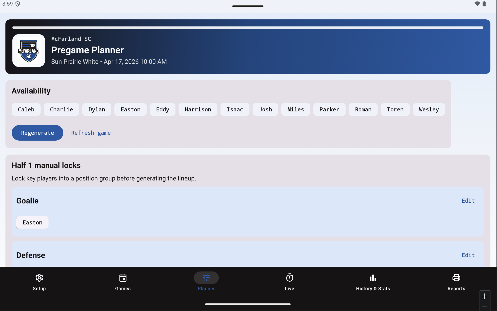
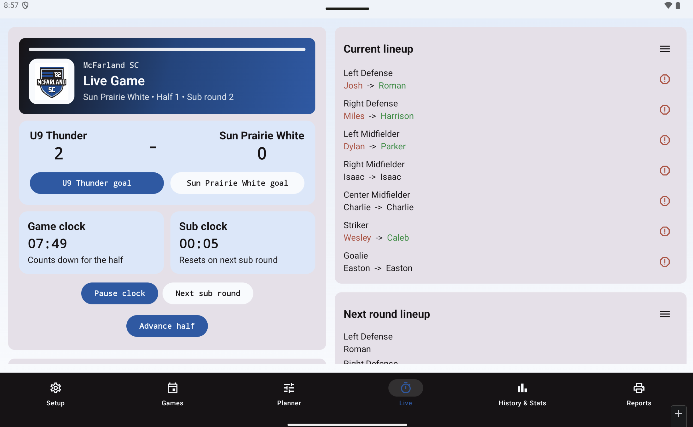

# Soccer Game Manager

Soccer Game Manager is a local-first Android app for youth soccer coaches who need fast, reliable in-game tools on the sideline. The app is built for managing one team today, with the design shaped so it can expand to multiple teams later without changing the day-to-day workflow.

The current build focuses on the full match loop:

- team setup and roster management
- game scheduling with date and time pickers
- pregame lineup planning and substitution generation
- live scorekeeping, dual clocks, and substitution timing
- injury handling and unplanned subs
- historical player and team statistics
- printable one-page game reports

## What The App Does

### Team setup

- Set a team name and team year
- Edit the active roster, jersey numbers, keeper eligibility, and notes
- Set default half length and substitution interval
- Estimate planned substitution rounds automatically from game length and sub interval

### Games

- Create and edit games with opponent, location, date, and time
- Use Android date and time pickers instead of free-text scheduling
- Keep a separate game history for the active team

### Pregame planner

- Generate both halves and all planned substitution rounds before kickoff
- Respect the U9 position model:
  - Goalie
  - Left Defense
  - Right Defense
  - Left Midfielder
  - Center Midfielder
  - Right Midfielder
  - Striker
- Keep players out of the same position group in both halves whenever possible
- Balance group exposure, positions, keeper time, and playing time over the season
- Let the coach lock specific players into position groups before generating
- Let the coach manually adjust planned assignments after generation
- Freeze finalized games so historical assignments never change

### Live game management

- Show the current score at the top of the screen
- Run two clocks at once:
  - a half game clock that counts down
  - a substitution clock that resets on the next sub round and then runs into negative time when overdue
- Record goals by half and time-in-half
- Prompt for the goal scorer and assist on team goals
- Log opponent goals with the correct half and time
- Show a full goal log across both halves
- Handle injuries and unplanned substitutions during the match
- Restore injured players either immediately or at the next planned sub
- Keep current lineup and next lineup visible together, especially in landscape/tablet mode

### History & Stats

- Team snapshot with finalized game totals and score summary
- Per-player, per-position stats table
- Filter which metrics appear in each position cell
- View all major metrics together in a compact nested table layout
- Current tracked metrics include:
  - halves played
  - minutes played
  - goals
  - assists
  - score differential

### Reports

- Build a one-page printable lineup and substitution report for each game
- Include the planned rounds, positions, and score boxes
- Print directly from the Android device

## Design Notes

The app is optimized for live sideline use first. That has shaped several design decisions:

- Local-first data model: all data is stored on-device with no account or backend dependency
- Large live controls: core in-game actions are reachable from a single screen
- Planner-to-live continuity: the generated plan feeds directly into the live workflow
- Locked history: once a game is finalized, assignments and events are treated as historical record
- Tablet-friendly layout: landscape mode keeps more of the live plan visible at the same time

The current UI uses McFarland-inspired branding, including the club badge and a blue, black, and white color palette.

## Technical Overview

### Stack

- Kotlin
- Jetpack Compose
- Room
- DataStore
- Navigation Compose
- Coroutines and Flow
- MVVM-style state management

### Project structure

- `app/src/main/java/com/example/soccergamemanager/data`
  Room entities, DAOs, repository logic, settings storage, and persistence helpers
- `app/src/main/java/com/example/soccergamemanager/domain`
  Lineup generation, metrics calculation, report formatting, and soccer rules
- `app/src/main/java/com/example/soccergamemanager/ui`
  Screens, navigation, view models, live workflow, and print helpers

### Key lineup rules currently implemented

- One player per on-field position
- Goalie is fixed within a half
- Players should not repeat the same position group in both halves unless unavoidable
- If there are not enough players for a full change, players staying on the field remain in the same position across rounds
- Locked or finalized games do not regenerate

## Build And Run

### Requirements

- Android Studio
- JDK 17
- Android SDK for API 35
- A connected Android device, Fire tablet, or emulator

Project defaults:

- `compileSdk = 35`
- `targetSdk = 35`
- `minSdk = 26`

### Build a debug APK

```bash
cd /Users/Shared/soccer_game_management
./gradlew assembleDebug
```

Output:

- `app/build/outputs/apk/debug/app-debug.apk`

### Build a signed release APK

```bash
cd /Users/Shared/soccer_game_management
./gradlew assembleRelease
```

Output:

- `app/build/outputs/apk/release/app-release.apk`

## Install On A Fire Tablet

Enable Developer Options and ADB on the tablet, then install with `adb`.

Debug example:

```bash
/Users/andrewjakubowski/Library/Android/sdk/platform-tools/adb install -r /Users/Shared/soccer_game_management/app/build/outputs/apk/debug/app-debug.apk
```

Release example:

```bash
/Users/andrewjakubowski/Library/Android/sdk/platform-tools/adb install -r /Users/Shared/soccer_game_management/app/build/outputs/apk/release/app-release.apk
```

If the launcher icon or cached app state does not refresh cleanly, uninstall once and reinstall:

```bash
/Users/andrewjakubowski/Library/Android/sdk/platform-tools/adb uninstall com.example.soccergamemanager
```

## Testing

Run the unit test suite with:

```bash
cd /Users/Shared/soccer_game_management
./gradlew testDebugUnitTest
```

The project includes tests around lineup generation and metrics behavior, including season balancing, position assignment rules, and tracked stat calculations.

## Screenshots

### Pregame planner

Manual locks and availability controls make it easy to anchor a few players, then let the app generate the rest of the game plan.



### Live game

The live screen keeps the score, dual clocks, current lineup, and next sub round visible together so coaches can manage the match from one place.



### History & Stats

The history view combines team-level results with a per-player, per-position stat table that can show halves, minutes, goals, assists, and differential together.


## Roadmap Notes

The current app is team-centered in the UI, even though some of the persistence layer still uses season-era naming internally for compatibility. That keeps the path open for future support of multiple teams with separate rosters, games, and histories.

Potential future enhancements include:

- true multi-team support
- richer drag-and-drop planning tools
- Excel import from the original planning workbook
- expanded analytics and lineup comparisons
- package name and release signing cleanup for production distribution
